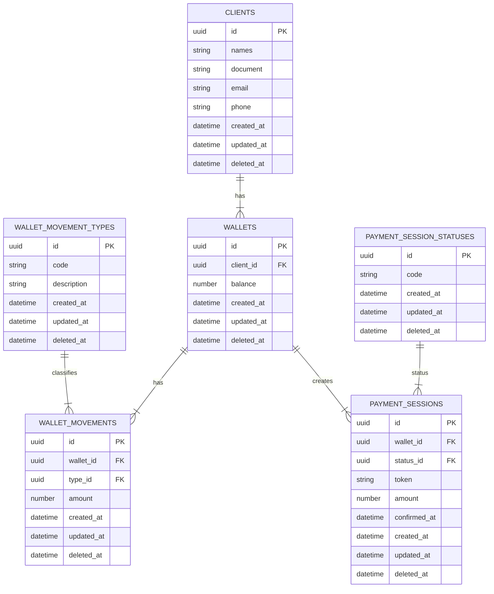

```mermaid
erDiagram

    CLIENTS {
        uuid id PK
        string names
        string document
        string email
        string phone
        datetime created_at
        datetime updated_at
        datetime deleted_at
    }

    WALLETS {
        uuid id PK
        uuid client_id FK
        number balance
        datetime created_at
        datetime updated_at
        datetime deleted_at
    }

    WALLET_MOVEMENT_TYPES {
        uuid id PK
        string code
        string description
        datetime created_at
        datetime updated_at
        datetime deleted_at
    }

    WALLET_MOVEMENTS {
        uuid id PK
        uuid wallet_id FK
        uuid type_id FK
        number amount
        datetime created_at
        datetime updated_at
        datetime deleted_at
    }

    PAYMENT_SESSION_STATUSES {
        uuid id PK
        string code
        datetime created_at
        datetime updated_at
        datetime deleted_at
    }

    PAYMENT_SESSIONS {
        uuid id PK
        uuid wallet_id FK
        uuid status_id FK
        string token
        number amount
        datetime confirmed_at
        datetime created_at
        datetime updated_at
        datetime deleted_at
    }

    %% RELACIONES %%

    CLIENTS ||--|{ WALLETS : has
    WALLETS ||--|{ WALLET_MOVEMENTS : has
    WALLET_MOVEMENT_TYPES ||--|{ WALLET_MOVEMENTS : classifies

    PAYMENT_SESSION_STATUSES ||--|{ PAYMENT_SESSIONS : status
    WALLETS ||--|{ PAYMENT_SESSIONS : creates
```
